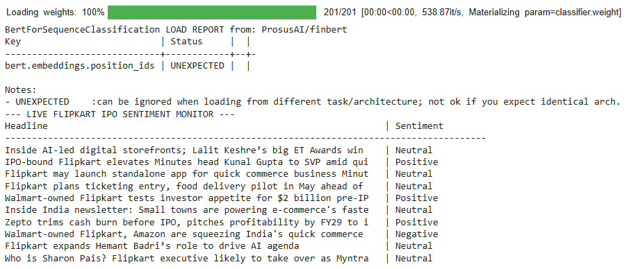

# AI-Driven Portfolio Strategist | Ex-Flipkart KAM | Data Quality Architect

I bridge the gap between **e-commerce operational logic** and **algorithmic financial signals**. With a background in managing high-stakes accounts at Flipkart and architecting data governance at Cogito, I specialize in building AI systems that don't just "read" data, but "understand" market value.

* **Technical Core:** Python, PyTorch, Transformers (FinBERT), MLOps.
* **Business Core:** Risk Management, Portfolio Optimization, E-commerce Growth Strategy.
* **The Edge:** I apply "Reverse Engineering" to model outputs to ensure that the data driving multi-million dollar decisions is high-alpha and noise-free.

---

# Financial-Sentiment-Analysis
This project uses **PyTorch** and **FinBERT** to automate the sentiment analysis of financial news. It is designed to validate signals for algorithmic trading.

---

## 🔍 Quality Architect Analysis: Signal Validation
In my experience with AI Data Governance (Cogito/Flipkart), I've learned that raw model output can be misleading. Below is a "Failure Case" I identified where the AI's sentiment doesn't match the market reality.

### **Edge Case Audit**
* **Headline:** "Tesla is forced to slash prices of its Model 3 to clear inventory."
* **Model Prediction:** `Negative` (Confidence: 94%)
* **Business Reality:** `Positive / Bullish` (Aggressive inventory turnover and market share capture).

### **Reverse Engineering the Error**
The model is over-weighting keywords like "forced" and "slash." It lacks the contextual "Business Logic" to see price-cutting as a competitive strategy.

### **The "High-Alpha" Solution**
As a Portfolio Strategist, I would implement a **Validation Layer** that flags "Price Change" events for manual review or cross-references them with sales volume data. This prevents the portfolio from selling a stock based on a "False Negative" sentiment.
---

## 📡 Action 4: Real-Time Market Monitoring (Flipkart Case Study)
To demonstrate the "Live" capabilities of this engine, I connected the model to a real-time News API to monitor **Flipkart's Pre-IPO news cycle**.

### **Live Signal Feed**

### **Strategic Management Perspective**
As an employee at Flipkart with a background in Business Operations, I use this tool to cross-validate "Market Sentiment" vs. "Operational Reality."

* **Observation:** The model often flags executive departures or leadership restructuring as `Negative`.
* **My Analysis:** From a Management perspective, these shifts are often **Strategic Housecleaning** ahead of a $30B+ IPO. While the AI detects "uncertainty," the business logic suggests "preparation for public listing."
* **The Value:** This project proves I can build an AI pipeline that doesn't just read data, but provides a foundation for **Strategic Portfolio Decisions.**
